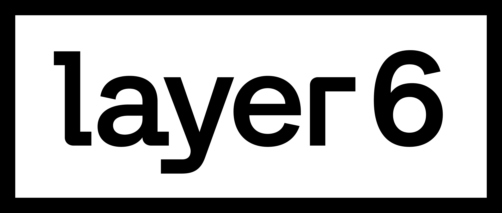
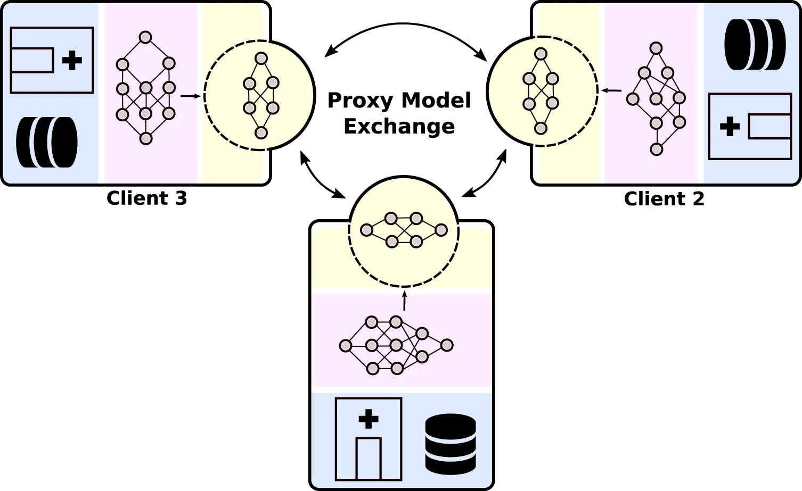

# ProxyFL - Decentralized federated learning through proxy model sharing
Authors: [Shivam Kalra*](https://scholar.google.ca/citations?user=iEwZn18AAAAJ&hl=en), [Junfeng Wen*](https://junfengwen.github.io/), [Jesse C. Cresswell*](https://scholar.google.ca/citations?user=7CwOlvoAAAAJ&hl=en), [Maksims Volkovs](http://www.cs.toronto.edu/~mvolkovs), [Hamid R. Tizhoosh&dagger;](https://scholar.google.ca/citations?user=Mzinpo0AAAAJ&hl=en)  
* &ast; Denotes equal contribution
* &dagger; University of Waterloo / Vector Institute
<!-- [](https://layer6.ai/) -->
### Abstract
Institutions in highly regulated domains such as finance and healthcare often have restrictive rules around data sharing. Federated learning is a distributed learning framework that enables multi-institutional collaborations on decentralized data with improved protection for each collaborator’s data privacy. In this paper, we propose a communication-efficient scheme for decentralized federated learning called ProxyFL, or proxy-based federated learning. Each participant in ProxyFL maintains two models, a private model, and a publicly shared proxy model designed to protect the participant’s privacy. Proxy models allow efficient information exchange among participants without the need of a centralized server. The proposed method eliminates a significant limitation of canonical federated learning by allowing model heterogeneity; each participant can have a private model with any architecture. Furthermore, our protocol for communication by proxy leads to stronger privacy guarantees using differential privacy analysis. Experiments on popular image datasets, and a cancer diagnostic problem using high-quality gigapixel histology whole slide images, show that ProxyFL can outperform existing alternatives with much less communication overhead and stronger privacy.
### Graphic Overall view of ProxyFL
[](https://www.nature.com/articles/s41467-023-38569-4/figures/1)
See image source at [Nature Communications](https://www.nature.com/articles/s41467-023-38569-4/figures/1)
### Prerequisite
- Python 3.9
```bash
conda create -n ProxyFL python=3.9
conda activate ProxyFL
```
- PyTorch 1.9.0
```bash
conda install pytorch=1.9.0 torchvision=0.10.0 numpy=1.21.2 -c pytorch
```
- mpi4py 3.1.2
```bash
conda install -c conda-forge mpi4py=3.1.2
```
- opacus 0.14.0
```bash
pip install 'opacus==0.14.0'
```
- matplotlib 3.4.3
```bash
conda install -c conda-forge matplotlib=3.4.3
```

### Run experiment
Download data via
```bash
bash download_data.sh
```
Then run the script
```bash
bash run_exp.sh
```
### Citation
If you find this code useful in your research, please cite the following paper:

    @article{kalra2021proxyfl,
        author={Kalra, Shivam and Wen, Junfeng and Cresswell, Jesse C. and Volkovs, Maksims and Tizhoosh, H. R.},
        title={Decentralized federated learning through proxy model sharing},
        journal={Nature Communications},
        year={2023},
        month={May},
        day={22},
        volume={14},
        number={1},
        pages={2899},
        issn={2041-1723},
        doi={10.1038/s41467-023-38569-4}
    }

### Useful links
- [ProxyFL Paper](https://www.nature.com/articles/s41467-023-38569-4)
- [layer6 Website](https://layer6.ai/)
- [Patent](https://patents.justia.com/patent/20230153461#claims)
- [University of Waterloo](https://uwaterloo.ca/)

### Disclaimer
This technology is patneted by [Layer6](https://layer6.ai/). The code is provided for research purposes only and without any warranty. Any commercial use is prohibited. See [patent](https://patents.justia.com/patent/20230153461).
